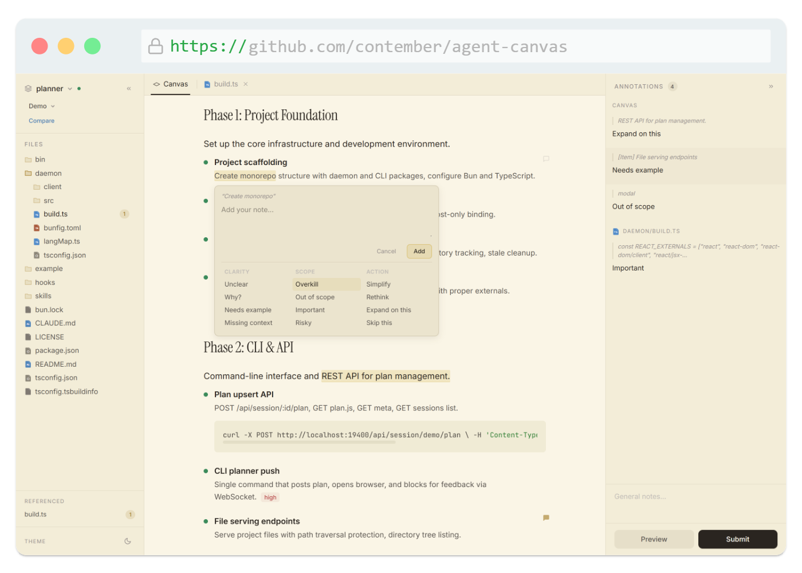
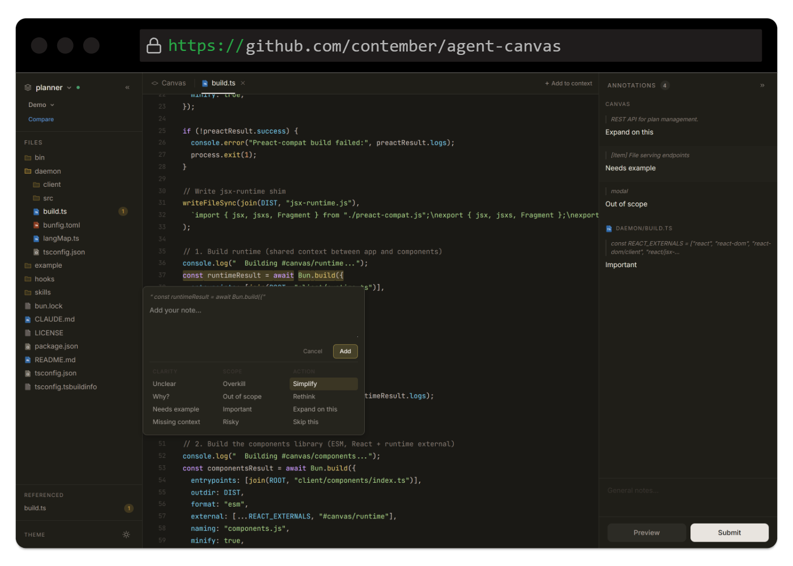

# Agent Canvas

Interactive browser-based visual canvas for [Claude Code](https://docs.anthropic.com/en/docs/claude-code). Create rich, annotatable JSX documents that render in the browser — with revision history, inline annotations, and structured feedback that flows back to Claude.




## What it does

When Claude needs to present a plan, review, explanation, or decision — instead of dumping markdown in the terminal — it renders a full interactive canvas in your browser. You can:

- **Annotate** any element with inline comments
- **Choose options**, fill inputs, rate with sliders
- **Browse files** referenced in the canvas
- **Review revisions** as Claude iterates
- **Send structured feedback** back to Claude in one click

## Install

```bash
# Register the skill and hooks in Claude Code
bunx agent-canvas install global    # for all projects
bunx agent-canvas install local     # for current project only
```

This installs:
- The `/canvas` skill so Claude knows how to use it
- A `SessionStart` hook that sets up session IDs automatically

**Requires [Bun](https://bun.sh/) runtime.**

## Usage in Claude Code

Once installed, use the `/canvas` command to create a canvas:

```
> /canvas Plan the authentication refactor
> /canvas Show me an architecture overview
> /canvas Review this PR
```

Claude creates a JSX document, pushes it to a local daemon, and opens it in your browser at `http://localhost:19400/s/<session-id>`.

### Flow patterns

Claude uses different canvas flows depending on the task:

| Flow | When | Rounds |
|------|------|--------|
| **Feature** | Vague requests ("add auth") | Discovery → Requirements → Plan → Implementation → Summary |
| **Plan** | Clear requirements | Plan → Implementation → Summary |
| **Explain** | "How does X work?" | Single canvas |
| **Review** | Code/architecture review | Findings → Fix Plan → Summary |
| **Decision** | Choosing between options | Single canvas with comparison |

## Theming

Agent Canvas supports light and dark themes, automatically matching your system preference.

**Dark mode**



## Development

```bash
bun install
bun run build                  # build client assets
bun daemon/build.ts --watch    # watch mode

# Test with demo canvas
bun bin/agent-canvas.ts daemon start
CANVAS_SESSION_ID=demo bun bin/agent-canvas.ts push example/plan.jsx --label "Demo"
# Open http://localhost:19400/s/demo
```

## License

MIT
